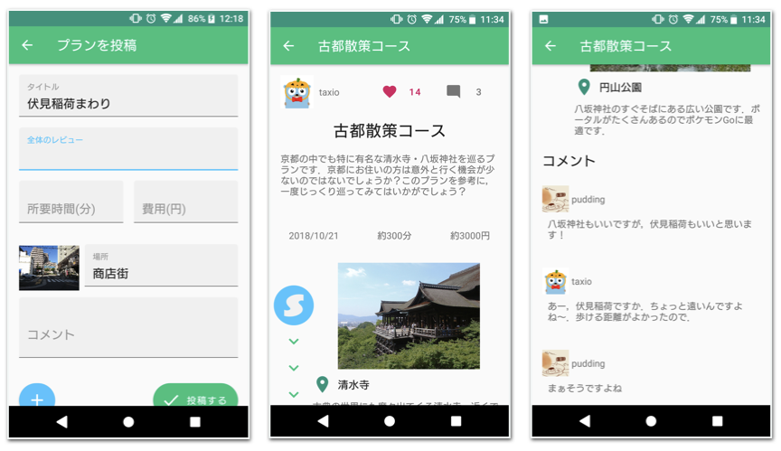

## 製品概要

### デートプラン X Tech

一人で悩むのはもう終わり

### 背景

デートスポット，ランチや喫茶のお店，移動手段，天候．多くのことを調べ，悩み，人は『デートプラン』を考えます．

相手のことを想えばこそ，しかし，新しいデートプランを毎回のように考えるのは至難の業です．その結果，いつの間にかデートがマンネリ化してしまったり，デートプランをたてるのが苦しくなってしまったりします．

また，デートはプライベートな事項なので，デートプランを誰かに相談することを躊躇してしまいがちです．そのため，「いいデートプランをたてれたか」といった，『デートプランの評価』を確かめることが難しいです．

以上のように，デートは楽しいものである反面，

1. デートプランをたてるのは容易ではない
2. そのがんばりの評価を得ずらい

という問題があると考えました．

### 製品説明

plannapはデートプランをSNSのように共有できるサービスです．デートスポットを紹介するサービスは今までにも存在しましたが，それらを繋いだ『デートプラン』として情報を共有することができるサービスは著名なものがありませんでした．

plannapは，デートプランの

1. **投稿**
2. **閲覧**
3. **レスポンス**

という３つの機能で構成されています．

### 特長

#### 1. デート"プラン"として投稿

デートスポットをどう組み合わせるか，どの順番でまわるか．デートプランには，各人の個性が色濃く現れています．それは，デートスポットを細切れに紹介することでは伝えられない情報です．デートプランを一つの作品として投稿することで，こうした情報を落とさずに共有することができます．

#### 2. みんなの投稿したデートプランを閲覧

投稿されたデートプランを閲覧することで，閲覧者は今まで知らなかったデートスポットの組み合わせを発見することが来ます．投稿されたデートプランを参考にすることで，普段と違ったデートを楽しむことができます．

#### 3. レスポンスによって投稿者にフィードバック

閲覧者は，デートプランの投稿に対して「いいね！」やコメントを送ることができます．投稿者はこうした反応を得ることで，自身のデートプランに自信が持てたり，さらにデートプランを投稿するモチベーションに繋がります．

### 解決できること

①手軽にデートプランをたてられる

②自分のデートプランの客観的な評価を得られる

### 展望
**レスポンス機能の拡充**
時間と労力をかけて考えたデートプランにポジティブなレスポンスがもらえれば，投稿者にとっては喜びとなり，デートプランを投稿するモチベーションに繋がります．また，デートプランのプールが増えれば増えるほど，閲覧者にとっては新しい発見をしやすくなります．

そこで，より詳細なレスポンスを投稿者に返す仕組みを考えています．具体的には，投稿されたデートプランを参考に実際にデート活用した人から送られるデートプランレポートです．自分の考えたデートプランを活用して，閲覧者がデートを楽しんでいることを知れば，また投稿したいと思える大きなインセンティブになるはずです．

## 開発内容・開発技術

リポジトリ一覧

- https://github.com/jphacks/KB_1809
- https://github.com/jphacks/KB_1809_2

### 活用した技術
#### API・データ
今回スポンサーから提供されたAPI、製品などの外部技術があれば記述をして下さい。

* 農研機構 簡易逆ジオコーディングサービス
    * https://www.finds.jp/rgeocode/index.html.ja
    * https://github.com/jphacks/KB_1809_2/issues/3

#### フレームワーク・ライブラリ・モジュール

* Python
    * バックエンドサーバ
    * Django
    * Django REST Framework
    * Django REST Swagger
* Docker
    * デプロイ及び開発に使用
    * Docker-compose
    * Let's EncryptによるSSL化
* Android
    * Android Architecture Components のよるMVVMｱｰｷﾃｸﾁｬの採用
    * Dagger2
    * Retrofit2

#### デバイス

* Androidは基本的にエミュレータで開発
* Xperia X Performance

### 研究内容・事前開発プロダクト（任意）
ご自身やチームの研究内容や、事前に持ち込みをしたプロダクトがある場合は、こちらに実績なども含め記載をして下さい。

* Travis CIによるCI/CD
    * https://github.com/jphacks/KB_1809_2/blob/dev/.travis.yml

### 独自開発技術（Hack Dayで開発したもの）

#### 2日間に開発した独自の機能・技術

* 必要なバックエンドAPIを全てフルスクラッチで実装．
    * 単純なGETやPOSTだけでなく検索機能も含めた実用的なAPIを実装した
        * https://github.com/jphacks/KB_1809_2/tree/dev/src
    * Swaggerを用いて開発とドキュメント化を同時並行で行い，クライアント側との情報共有をシームレスに行った
        * https://plannap.aquatan.studio/swagger/
        * https://plannap.aquatan.studio/plan/
    * 各スポットの緯度経度からデートプランのおおまかな地域を逆ジオコーディングにより推定
* Androidアプリを全てフルスクラッチで実装．
    * UXを考え、スポット位置は画像のExifから緯度経度を取得し算出した
    * 効率的に開発を進めるため、MVVMｱｰｷﾃｸﾁｬを採用

